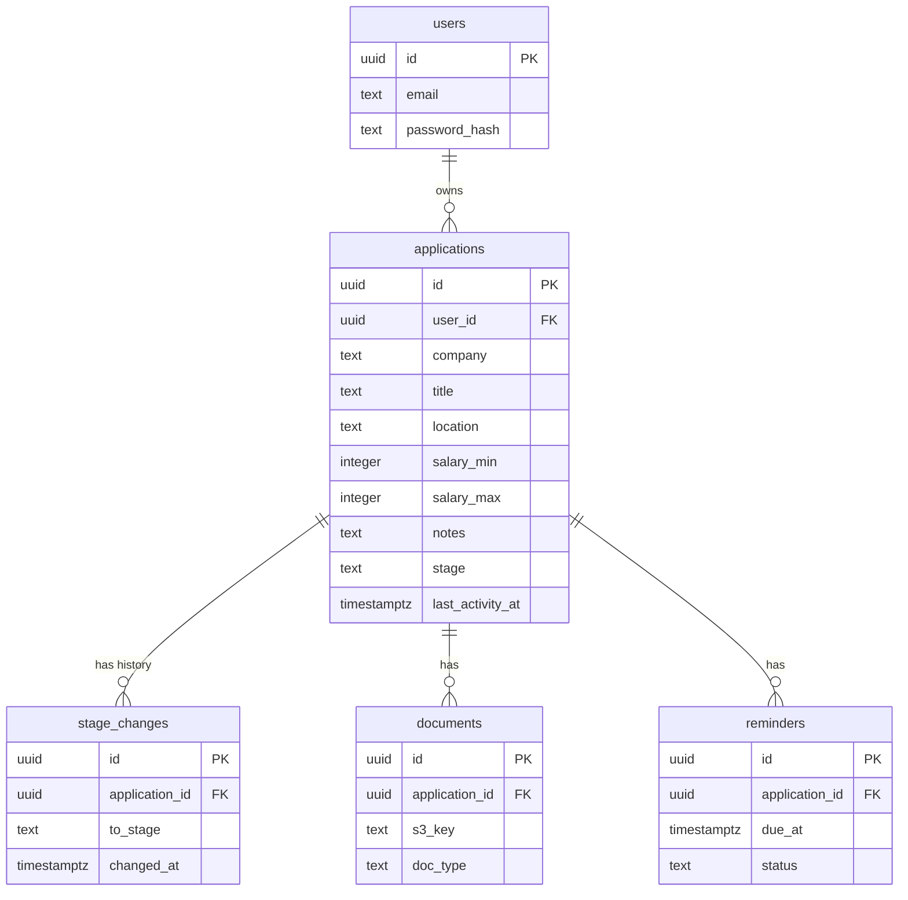

```mermaid
erDiagram
    users ||--o{ applications : owns
    applications ||--o{ stage_changes : "has history"
    applications ||--o{ documents : has
    applications ||--o{ reminders : has

    users {
        uuid id PK
        text email
        text password_hash
    }
    applications {
        uuid id PK
        uuid user_id FK
        text company
        text title
        text location
        integer salary_min
        integer salary_max
        text notes
        text stage
        timestamptz last_activity_at
    }
    stage_changes {
        uuid id PK
        uuid application_id FK
        text to_stage
        timestamptz changed_at
    }
    documents {
        uuid id PK
        uuid application_id FK
        text s3_key
        text doc_type
    }
    reminders {
        uuid id PK
        uuid application_id FK
        timestamptz due_at
        text status
    }
```
